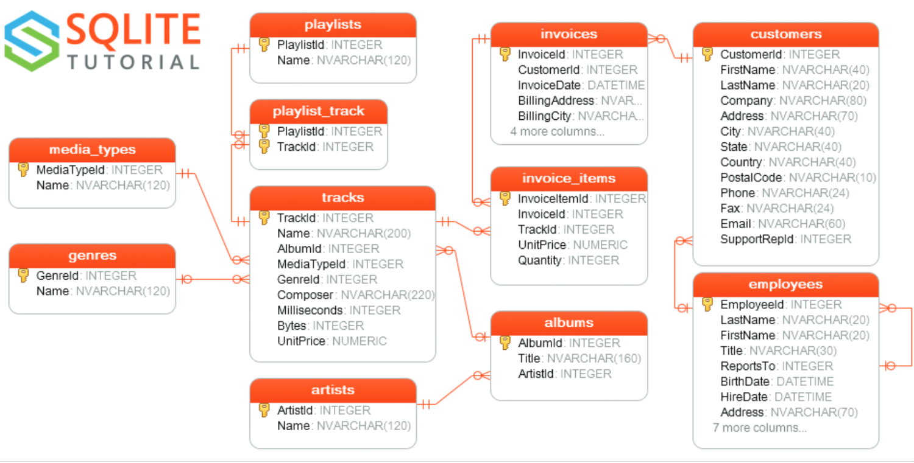

# docker-phpliteadmin

Put existing sqlite files in the volume or folder mapped to /sqlite. Allowed extensions are .db, .db3, .sqlite, .sqlite3

git clone https://github.com/sonnyyu/docker-phpliteadmin/

cd docker-phpliteadmin

Start up docker stack as deamon

docker-compose up -d

Stop docker stack

docker-compose down -v

open phpliteadmin by http://ip:9000

<a href="https://github.com/sonnyyu/docker-phpliteadmin/raw/main/resource/diagram.pdf" >Download Database Diagram PDF</a>
