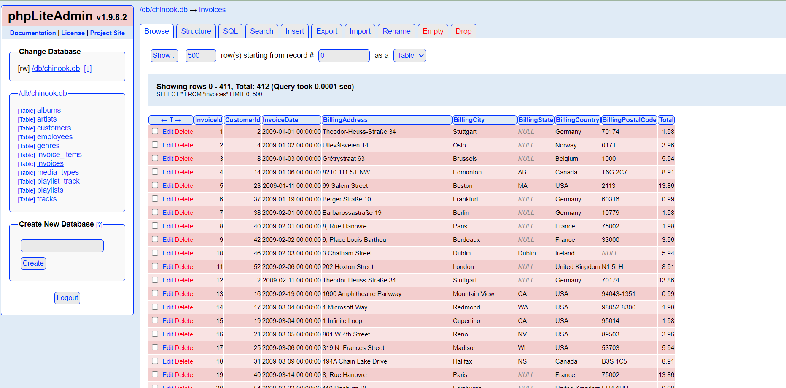

# docker-phpliteadmin

Put existing sqlite files in the volume or folder mapped to /sqlite. Allowed extensions are .db, .db3, .sqlite, .sqlite3

Start up docker stack as deamon

docker-compose up -d

Stop docker stack

docker-compose down -v
